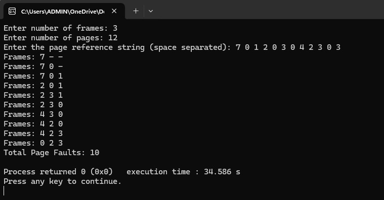
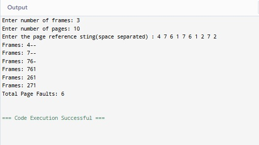

#FIFO Page Repalcement Algorithm
# program file

# sample output

# tested output

#LRU Page Replacement Algorithm
# program file

# sample output

# tested output

#Optimal Page Replacement Algorithm
# program file

# sample output

# tested output

